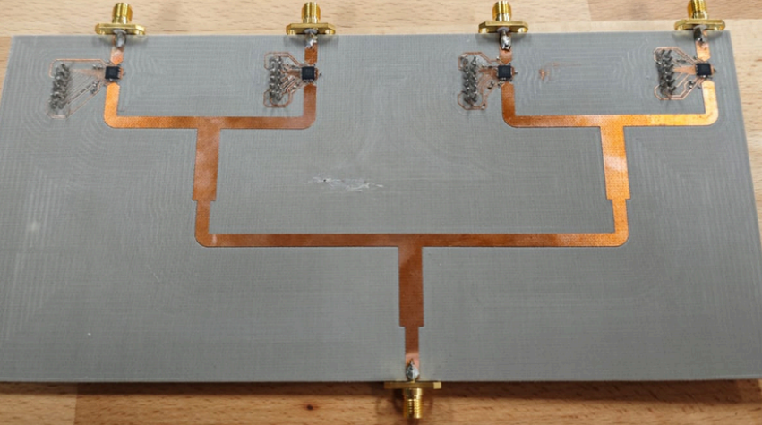

# 📡 Antenne Patch Imprimée à Balayage Électronique

## Présentation du projet
Ce projet porte sur le **dimensionnement analytique**, la **conception**, la **simulation électromagnétique** et la **validation expérimentale** d’un **réseau d’antennes patch micro-ruban à balayage électronique**, fonctionnant dans la **bande WiFi 2,4 GHz**.

Le travail a été réalisé dans le cadre d’un **projet scolaire** pour [CoHoMa](https://www.defense.gouv.fr/aid/actualites/cohoma-iii-ledition-consolidation)

---

## Cahier des charges
- **Bande de fréquence** : 2,40 – 2,48 GHz  
- **Gain cible** : 20 dBi  
- **Ouverture via le balayage électronique** : −60° à +60°  
- **Ouverture angulaire verticale (HPBW)** : ≈ 30°  
- **Polarisation** : linéaire  
- **Balayage** : électronique par contrôle de phase  

---

## Architecture de l’antenne
- **Élément rayonnant** : patch micro-ruban carré (mode TM₁₀)  
- **Substrat** : εr = 2,6, h = 1,524 mm, tanδ faible  
- **Réseau** : matrice **4 × 4 (16 éléments)**  
- **Excitation** : uniforme, broadside  
- **Réseau d’alimentation** : arborescence micro-ruban symétrique  

---

## Logiciels utilisés
- ADS
- KiCad
- Excel

# Résultats

|   Fichier   |  Lien | 
|---    |:-:    |
|   Rapport du projet PDF   |  [lien.pdf](https://github.com/Ellimaaac/Antenne-imprimee-patch-a-balayage-lectronique/blob/main/2026_ESC_Projet_Circuit_JOSSERON_MENEGALLI_BAINARD_LANFREDI.pdf)    |  
| Fichiers de conception et simulation ADS   |     | 

### Antenne et Arborescence avec déphaseurs

 

 

### Pré-Dimensionnement 

 

